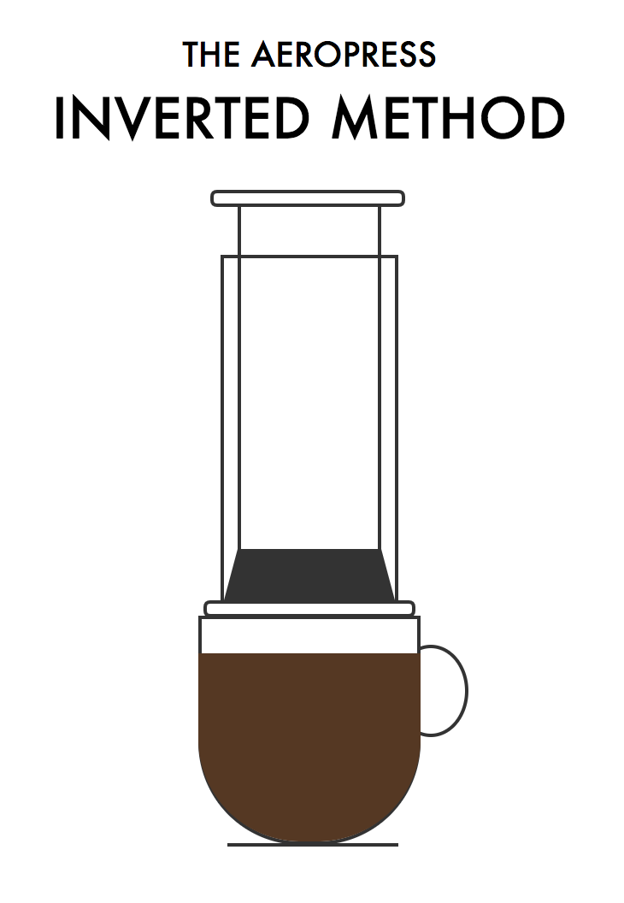

  

# [The Inverted Method](https://tkilgour.github.io/inverted-method/)

A simple single serving site for the Aeropress inverted coffee brewing method. 

Built with zero dependencies and illustrated with pure CSS.

Inspired by Wentin Zhang's [talk](https://www.youtube.com/watch?v=Y0_FMCji3iE) about how she draws with CSS.
